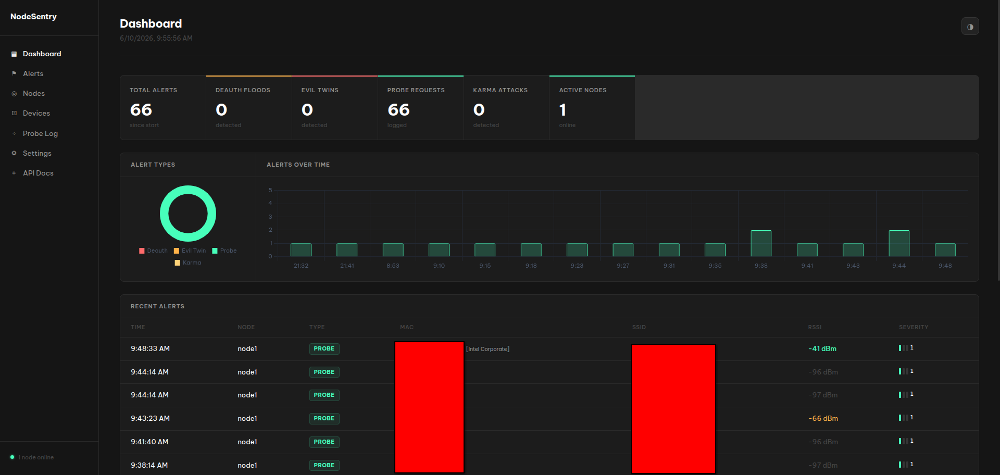
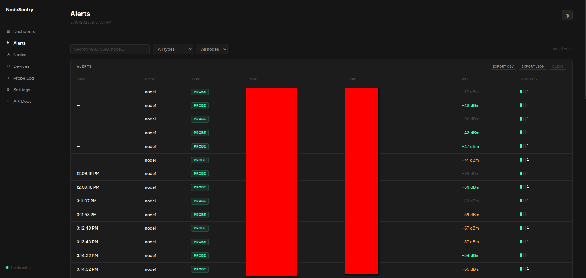
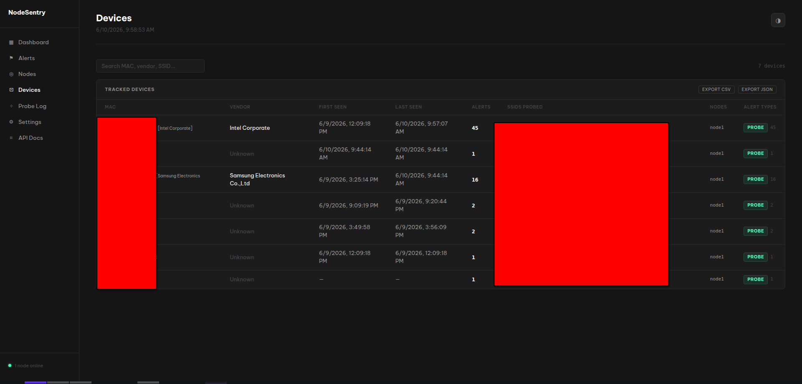
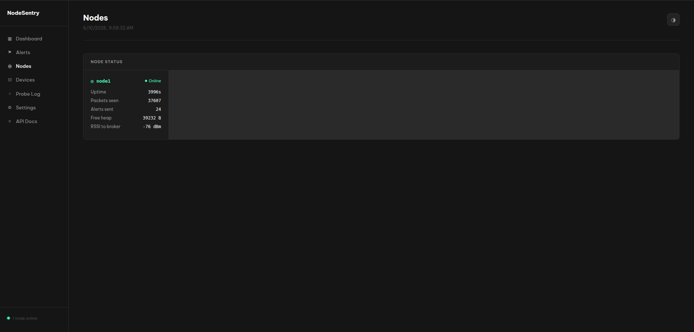
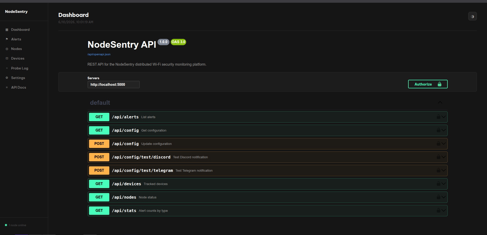

# NodeSentry

A distributed embedded Wi-Fi security monitoring platform. NodeSentry deploys WeMos D1 Mini Pro nodes around a space to passively monitor 802.11 traffic and detect common Wi-Fi attacks in real time, aggregating data to a central dashboard.



---

## Behind the Name

**Node** represents the distributed WeMos micro-sensors - each one a small, low-power embedded device deployed independently across a physical space.

**Sentry** represents a passive guard standing at the perimeter, watching for threats without interfering with the environment it monitors.

Together: *a distributed network of digital guards protecting local airspace.*

---

## Architecture

```
 SENSOR LAYER
+-----------------------------------------------------+
|                                                     |
|   [D1 Mini Node 1]      [D1 Mini Node 2]           |
|   - monitor mode        - monitor mode              |
|   - detects deauth      - detects deauth            |
|   - logs probes         - logs probes               |
|   - edge processing     - edge processing           |
|   - local aggregation   - local aggregation         |
|          |                      |                   |
+----------+----------------------+-------------------+
           | MQTT over WiFi       | MQTT over WiFi
           | (JSON payloads)      |
           v                      v
 BROKER LAYER
+-----------------------------------------------------+
|                                                     |
|            Mosquitto MQTT Broker                    |
|            runs on your laptop / homelab            |
|            localhost:1883                           |
|                                                     |
|   topics:                                           |
|   nodes/node1/alerts                                |
|   nodes/node1/stats                                 |
|   nodes/node2/alerts                                |
|   nodes/node2/stats                                 |
|                                                     |
+---------------------+-------------------------------+
                      | subscribed via paho-mqtt
                      v
 BACKEND LAYER
+-----------------------------------------------------+
|                                                     |
|            Python / Flask app                       |
|                                                     |
|   - consumes MQTT messages                          |
|   - stores alerts to SQLite                         |
|   - REST API  GET /api/alerts                       |
|              GET /api/stats                         |
|              GET /api/nodes                         |
|   - pushes live updates via SocketIO                |
|                                                     |
+---------------------+-------------------------------+
                      | WebSocket + REST
                      v
 FRONTEND LAYER
+-----------------------------------------------------+
|                                                     |
|        Flask-served HTML/CSS/JS dashboard           |
|                                                     |
|   - live alert feed                                 |
|   - node status (online/offline)                    |
|   - attack type breakdown (Chart.js)                |
|   - per-node packet stats                           |
|   - MAC vendor resolution                           |
|   - RSSI signal strength indicators                 |
|                                                     |
+-----------------------------------------------------+
```

Each sensor node performs **edge processing and local aggregation** before publishing to the broker. Raw frame counts and threshold comparisons happen on-device, so the central database is not exposed to high-frequency packet bursts during active wireless attacks. Only meaningful events are forwarded upstream.

---

## Screenshots

| | |
|---|---|
|  |  |
| **Alerts** — paginated, filterable, severity-scored feed | **Devices** — per-MAC history, vendor, SSIDs & nodes seen |
|  |  |
| **Nodes** — live online/offline status & per-node stats | **API docs** — interactive OpenAPI / Swagger reference |

---

## Detection Capabilities

- **Deauth flood detection** - counts deauthentication frames per source MAC in a sliding time window and flags sustained floods
- **Probe request logging** - logs every device broadcasting saved network names (MAC, SSID, RSSI, timestamp)
- **Evil twin AP detection** - flags new BSSIDs broadcasting a known legitimate SSID
- **Karma attack detection** - flags devices responding to probe requests for SSIDs they have never beaconed
- **Hardware OUI Fingerprinting** - the backend parses the first three octets of each MAC address against an OUI prefix table to identify device manufacturers such as Apple, Samsung, Espressif, and Raspberry Pi. Vendor names are displayed inline in the alert feed for faster threat assessment
- **Node Status and Failure Tracking (LWT)** - each node registers an MQTT Last Will and Testament on connect and republishes a retained `online` status each upload cycle. If a node drops off the network unexpectedly *while connected*, the broker publishes its retained `offline` LWT and the dashboard flags it offline. Note: because nodes disconnect gracefully between upload cycles to sniff, a node that dies mid-sniff keeps a stale `online` status until it stops reporting stats

---

## Project Structure

```
node-sentry/
├── nodes/
│   ├── firmware/
│   │   └── firmware.ino        # D1 Mini C++ firmware
│   └── mock_node.py            # MQTT simulator for testing
├── server/
│   ├── main.py                 # Flask app, routes, SocketIO, MQTT wiring
│   ├── mqtt_client.py          # MQTTClient class
│   ├── database.py             # SQLite layer - all reads and writes go here
│   ├── notifier.py             # Telegram and Discord notification engine
│   ├── config.py               # config.json reader/writer
│   ├── templates/              # Jinja2 HTML templates
│   │   ├── base.html
│   │   ├── dashboard.html
│   │   ├── alerts.html
│   │   ├── nodes.html
│   │   ├── devices.html
│   │   ├── probes.html
│   │   ├── settings.html
│   │   └── api_docs.html
│   └── static/
│       ├── css/style.css
│       └── js/
│           ├── shared.js
│           ├── dashboard.js
│           ├── alerts.js
│           ├── nodes.js
│           ├── devices.js
│           ├── probes.js
│           └── settings.js
├── mosquitto/
│   └── mosquitto.conf
├── backfill_devices.py         # one-time migration: backfill device table from alerts
├── update_oui.py               # downloads and imports the IEEE OUI database
├── flash.sh                    # one-command firmware flash (auto-detects serial port)
├── logging.sh                  # serial / MQTT log viewer
├── docker-compose.yml
├── Dockerfile
├── config.json.example
└── .env.example
```

---

## Stack

| Layer | Technology |
|---|---|
| Node firmware | C++ / Arduino framework |
| Message broker | Mosquitto (MQTT) |
| Backend | Python, Flask, Flask-SocketIO, paho-mqtt |
| Database | SQLite with WAL mode |
| Frontend | HTML / CSS / JS, Chart.js |
| Auth | API key header (external clients) + HttpOnly session cookie (browser) |
| Rate limiting | Flask-Limiter |

---

## Docker

The easiest way to run NodeSentry is with Docker Compose.

### Prerequisites
- Docker
- Docker Compose

### Setup

```bash
git clone https://github.com/amiraliuks/node-sentry
cd node-sentry
cp .env.example .env
# Edit .env and set API_KEY and SECRET_KEY (both required)
```

Notification settings and detection thresholds are configured from the **Settings**
page in the dashboard and persist in the `nodesentry-data` volume — there is no
`config.json` to copy. (`config.json.example` documents the schema for reference.)

### Run

```bash
docker compose up -d
```

Open `http://localhost:5000` in your browser.

### Stop

```bash
docker compose down
```

### Logs

```bash
docker compose logs -f app
docker compose logs -f mosquitto
```

---

## Manual Setup

### 1. Install dependencies

```bash
sudo apt install mosquitto mosquitto-clients
git clone https://github.com/amiraliuks/node-sentry
cd node-sentry
python3 -m venv venv
source venv/bin/activate
pip install -r requirements.txt
cp .env.example .env
# Edit .env and set API_KEY and SECRET_KEY
```

### 2. Start the MQTT broker

```bash
mosquitto -v
```

### 3. Start the backend

```bash
python3 server/main.py
```

### 4. Open the dashboard

```
http://localhost:5000
```

### 5. Flash a node or run the mock

```bash
# Flash firmware to a connected WeMos (auto-detects the serial port)
./flash.sh

# Live node logs — choose USB serial or over-the-air MQTT
./logging.sh

# No hardware? Run the mock node instead
python3 nodes/mock_node.py
```

---

## Hardware

- WeMos D1 Mini Pro (ESP8266) + External SMA Antenna
- Arduino framework via PlatformIO or Arduino IDE

The external SMA antenna significantly extends passive monitoring range compared to the onboard PCB antenna, making it practical for monitoring larger spaces with a single node.

---

## API

API endpoints require an `X-API-Key` header (or `?api_key=` query param) when `API_KEY` is set — and the server refuses to start in production with it unset. The dashboard authenticates the browser with an `HttpOnly` session cookie instead, so the key is never exposed to page JavaScript. Interactive docs available at `/api/docs`.

| Method | Endpoint | Description |
|---|---|---|
| GET | `/api/alerts` | Paginated alert log. Params: `limit`, `page`, `type`, `node` |
| GET | `/api/stats` | Alert counts by type |
| GET | `/api/nodes` | Latest stats snapshot per node |
| GET | `/api/devices` | Tracked devices with first/last seen, alert counts, SSID history. Params: `limit`, `page` |
| GET | `/api/config` | Current notification and threshold configuration |
| POST | `/api/config` | Save updated configuration |
| POST | `/api/config/test/telegram` | Send a test Telegram message |
| POST | `/api/config/test/discord` | Send a test Discord embed |
| GET | `/api/docs` | Interactive API documentation |
| GET | `/api/openapi.json` | OpenAPI 3.0 spec |

---

## Security

A few things to know before exposing NodeSentry beyond localhost:

- **Set `API_KEY` and `SECRET_KEY`.** The server refuses to start in production
  (gunicorn / Docker) when `API_KEY` is unset, so the API is never open by
  accident. For an explicit local-only open run, set `NODESENTRY_DEV_MODE=1`,
  which binds to `127.0.0.1`. External/CLI clients authenticate with the
  `X-API-Key` header; the browser uses an `HttpOnly` session cookie, so the key
  is never exposed to page JavaScript.
- **The MQTT broker allows anonymous publish by default** so nodes are
  zero-config. The backend validates and bounds every payload (a malicious SSID
  cannot reach the dashboard as script), but anyone who can reach port `1883` can
  still spoof alerts. On an untrusted network, enable broker authentication +
  per-node ACLs + TLS — see [`mosquitto/mosquitto.conf`](mosquitto/mosquitto.conf).
- **Untrusted fields are escaped end to end** — the dashboard HTML-escapes
  SSIDs/MACs/node IDs, Telegram messages are HTML-escaped, and CSV exports
  neutralize spreadsheet formula injection.

---

## Roadmap

- [x] Project architecture and backend pipeline
- [x] Mock node for hardware-free testing
- [x] SQLite persistence with WAL mode and thread-local connections
- [x] Paginated REST API with API key auth and rate limiting
- [x] Live dashboard with Chart.js visualizations
- [x] MAC vendor OUI fingerprinting
- [x] RSSI signal strength color coding
- [x] Physical hardware verification on WeMos D1 Mini Pro
- [x] C++ firmware - deauth flood, probe logging, evil twin, and karma detection
- [x] MQTT Last Will and Testament for node failure tracking
- [x] Webhook notification engine (Telegram + Discord) with cooldown and severity filtering
- [x] Whitelist/ignore specific MAC addresses
- [x] Device tracker - per-MAC history of alert types, SSIDs seen, and nodes reported from
- [x] Settings page - live configuration of thresholds and notifications from the dashboard
- [x] Docker Compose packaging for one-command deployment
- [ ] Dynamic client-side node positioning map using RSSI triangulation

---

## Legal Notice

NodeSentry is intended strictly for use on networks you own or have received explicit written authorization to monitor. Passive monitoring of wireless traffic on networks without authorization is illegal in most jurisdictions, including Kosovo's Law No. 06/L-082 on Cybercrime.

This tool operates in passive monitor mode only - it never injects frames, sends deauthentication packets, or actively interferes with any network or device. All development and testing was conducted exclusively on the author's own private network.

The author assumes no responsibility for misuse of this software.

---

## License

Released under the [MIT License](LICENSE).

---

## Inspiration

[Satur8](https://github.com/dionmulaj/Satur8)